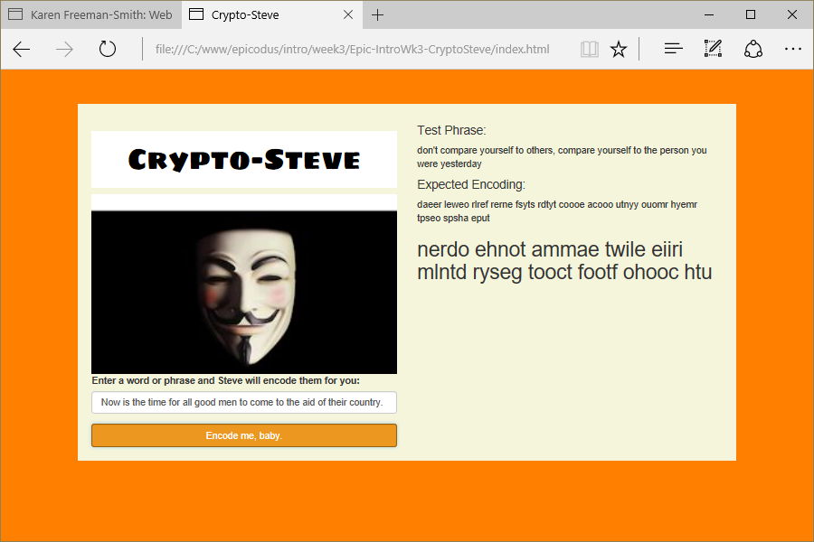

# Crypto-Steve
Version 0.0.1: August 18, 2016
by [Karen Freeman-Smith](https://karenfreemansmith.github.io), [Jena SanCartier](https://jenasancartier.github.io/portfolio-page) and [Ewa Manek](https://github.com/ewajm)

### Technologies Used
HTML, CSS, Bootstrap, JavaScript, jQuery

## Description
*[Epicodus](http://epicodus.com) Intro to Programming Week 3 Pair Project with J'ena SanCartier & Ewa Manek: A webpage named "Steve". Steve will take your phrase and encrypt it for you using a method known as crytosquares, [a classic method for composing secret messages called a square code.](https://www.learnhowtoprogram.com/intro-to-programming/arrays-looping/practice-roman-numerals).*

## Setup/Installation
* [View on Github Pages](https://karenfreemansmith.github.io/Epic-IntroWk3-CryptoSteve)
* _OR_
* Clone directory
* Open index.html in your favorite browser

## Support & Contact
For questions, concerns, or suggestions please email karenfreemansmith@gmail.com

## Specifications

## Known Issues
* None

## Legal
*Licensed under the GNU General Public License v3.0*

Copyright (c) 2016 Copyright _[Karen Freeman-Smith](https://karenfreemansmith.github.io), [Jena SanCartier](https://jenasancartier.github.io/portfolio-page) & [Ewa Manek](https://github.com/ewajm)_ All Rights Reserved.
